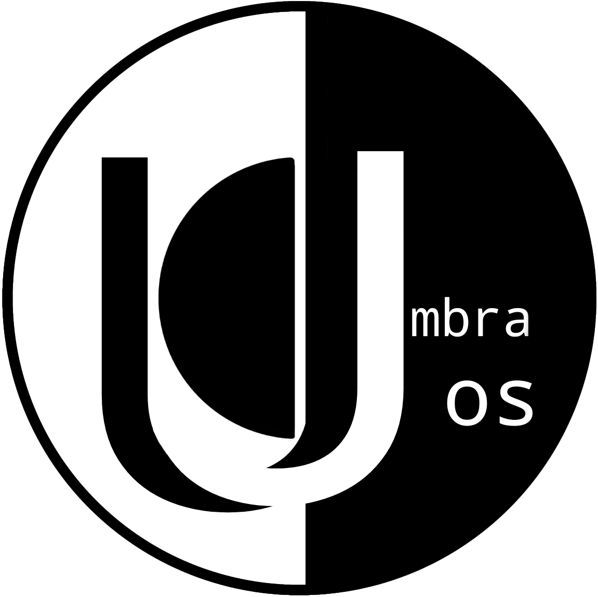

<p align="center">
  
</p>

> Nix-based OS built for cybersecurity learners and enthusiasts alike.

UmbraOS is a Nix-based operating system built to make cybersecurity education reproducible, approachable, and hands-on.

Rather than shipping hundreds of tools and expecting users to figure everything out themselves, UmbraOS focuses on guided learning through reproducible lab environments and optional AI-assisted instruction.

## Goals

- Reproducible cybersecurity labs using Nix
- Safe experimentation through sandboxing
- Optional AI assistance (Local GGUF / Ollama / GroqCloud / None)
- Beginner-friendly without sacrificing flexibility
- Privacy-first (no mandatory telemetry)

## Current Foundation

- [x] Bootable Hyprland live ISO
- [x] Custom Nix flake installer
- [x] Whole-disk and manual/dual-boot installation paths
- [x] MicroVM host and isolated-guest foundations
- [x] Declarative, schema-validated lab image catalog

## Planned Features

- [ ] Guided cybersecurity labs
- [ ] AI teaching assistant
- [ ] Lab authoring toolkit
- [ ] Community-contributed labs

## Status

v0.1 foundation preview. Use disposable hardware or virtual machines while the
installer continues hardware testing.

## Migrating an Existing NixOS Host

Do not switch an existing machine directly to `.#default`: that output contains
the repository development machine's hardware configuration and the fresh
install account defaults.

The guarded migration helper generates a private flake snapshot using the
current machine's detected hardware and existing normal user. It leaves the
user's password unmanaged so NixOS retains the current `/etc/shadow` entry,
preserves the account UID, home, primary group, and supplementary groups, and
performs a build plus dry activation before changing the running system.

First validate without changing the system:

```console
nix run .#migrate -- --build
```

To switch display managers safely, move to a virtual console with
`Ctrl+Alt+F3`, log in, and run:

```console
nix run .#migrate -- --switch
```

The previous NixOS generation remains available. To revert:

```console
sudo nixos-rebuild switch --rollback
```

Each attempt is retained beneath `/var/lib/umbra/migrations`; a successful
switch also points `/etc/nixos/umbra` at the active migration snapshot.

## Join the Family

